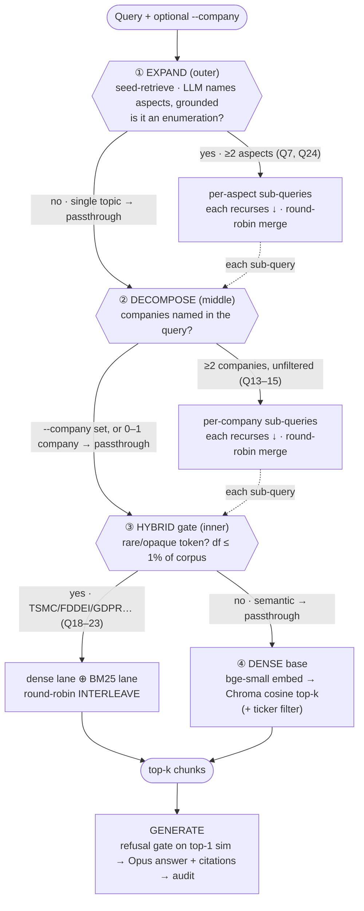

# Retrieval flow — the whole stage on one page

The shipped `ask` retriever is **`Expand(Decomposition(Hybrid(dense)))`** — three dispatch layers wrapped around dense retrieval, each a no-op unless its trigger fires. This page is the map so you don't have to read the five `*-notes.md` files to remember how a query flows or what we tried.

## What happens to a query (decision tree)

Each layer asks one question: **split (and recurse through the layers below) or pass straight down.** Splits merge their sub-results round-robin (guaranteed slots).



ASCII fallback (same thing):

```
Query (+ optional --company)
   │
 ① EXPAND ── enumeration? ──yes(Q7,Q24)──► split per aspect ─┐ (each aspect recurses ↓)
   │             │ no                                         │  round-robin merge ─► result
   ▼ pass down ◄─┘ ◄──────────────────────────────────────────┘
 ② DECOMPOSE ── ≥2 companies & unfiltered? ──yes(Q13-15)──► split per company ─┐ (each recurses ↓)
   │             │ no / --company set                                          │  round-robin merge ─► result
   ▼ pass down ◄─┘ ◄────────────────────────────────────────────────────────────┘
 ③ HYBRID gate ── rare/opaque token (df≤1%)? ──yes(Q18-23)──► dense ⊕ BM25 → INTERLEAVE ─► result
   │             │ no (semantic)
   ▼ pure dense
 ④ DENSE: bge-small → Chroma cosine top-k (+ ticker filter) ─► result
                                                                   │
                                                                   ▼
                                              GENERATE: refuse-gate → Opus + cite → audit
```

**Layer cheat-sheet** (each fires only when its trigger hits; otherwise identical to baseline dense):

| layer | triggers when | does | costs | golden Qs |
|---|---|---|---|---|
| ① Expand | LLM (grounded) finds ≥2 aspects | split per aspect, re-query, merge | 1 Haiku call (cached) | Q7, Q24 |
| ② Decompose | unfiltered + ≥2 companies named | split per company, merge | free (keyword detect) | Q13–15 |
| ③ Hybrid gate | query has a token in ≤1% of chunks | add BM25 lane, interleave | free (df lookup) | Q18–23 |
| ④ Dense | always (the base) | bge embed → cosine top-k | local | all |

## What we tried, and the verdict (so you don't re-litigate)

| # | Pattern | Target failure | Verdict | In stack |
|---|---|---|---|---|
| 1 | Eval harness (recall@k + MRR) | "is it better?" was unmeasurable | the foundation | — |
| 1b | Eval audit (label repair) | untrustworthy labels (Q12 mislabel) | fixed; `recall_reliable` flag | — |
| 2 | Reranking — cross-encoder | ranking | **wash** (minilm); bge = harness bug | ✗ |
| 7A | Decomposition — keyword company split | cross-company | **WIN** 0.67 → 0.94 | ✅ |
| 7B/B+ | Decomposition — LLM split | aspects / company | lost to 7A (blind, reworded queries rank worse) | ✗ |
| 8 | Hybrid — RRF fusion | lexical / opaque tokens | **wash** (one-lane cap) | ✗ |
| 8 | Hybrid — round-robin interleave | lexical / opaque tokens | **WIN** 0.30 → 0.70 | ✅ |
| 8 | Hybrid — df dispatch gate | semantic collateral | wash *alone* → **load-bearing composed** | ✅ |
| 9 | MMR — diversity re-selection | enumeration | **dead-end** (geometry ≠ aspects) | ✗ |
| 9 | Expand — grounded aspect split | enumeration | **WIN** 0.12 → 0.50 (first LLM win) | ✅ |

## The number ladder (golden-set v2, 24 questions)

```
DENSE baseline                         recall@5 0.59   hit@5 0.78
  + Decomposition + Hybrid (gated)     recall@5 0.73   hit@5 0.91     (cross-company 0.94, lexical 0.70)
  + Expand (FULL STACK, shipped)       recall@5 0.84   hit@5 1.00     (enumeration 0.50, lexical 0.90*)
```

\* lexical 0.70 → 0.90 is the **emergent** expand×hybrid win: expand's focused aspect queries un-dilute the opaque token so hybrid's BM25 nails Q18 TSMC — dead in every other config.

**The one-line spine:** every *drop-in* of a bigger/celebrated tool (cross-encoder, 10× LLM decomposer, RRF, MMR) measured **no**; the wins were cheap and deterministic — *except* enumeration, where an LLM finally earned its keep by being **grounded** in a retrieval pass first. See `eval-notes.md` for the harness, and `{reranking,decomposition,hybrid,enumeration}-notes.md` for each arc.
